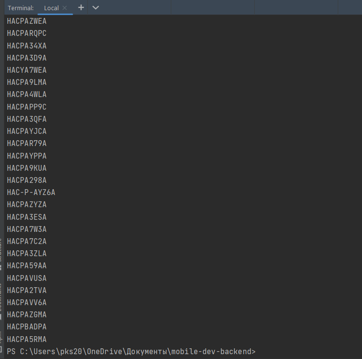
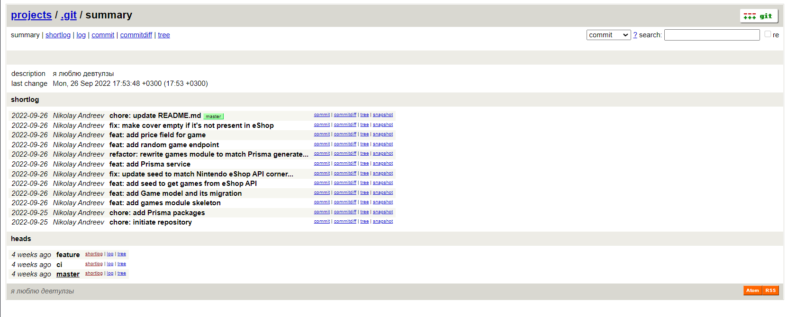
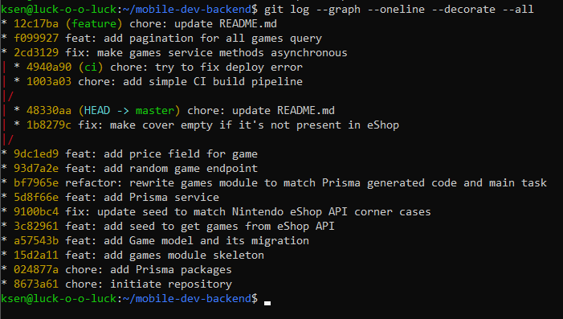
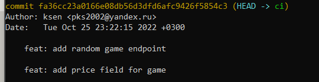
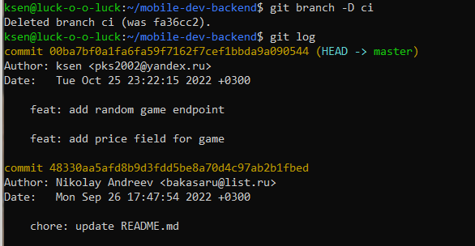
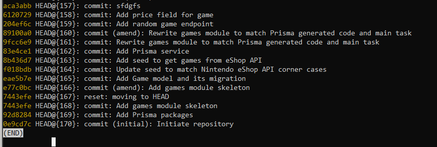
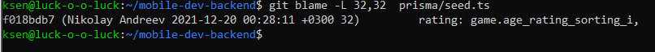
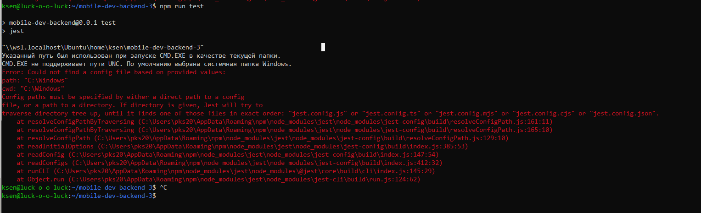
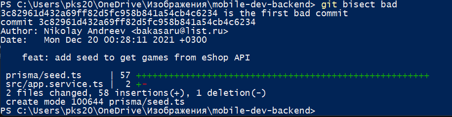

## Задание 0-1 ##
1. Во-первых, я молодец:

2. Wsl на винде тоже сойдёт:

## Задание 2 ##
_Описание задания_: Перенесите все коммиты, находящиеся в ветке ci, в ветку master с объединением всех коммитов в один и изменением сообщения таким образом, чтобы оно полностью описывало все вносимые изменения. Удалите ветку ci.
Для упрощения работы предлагаю следующее: визуализируем графом!
```bash
git log --graph --oneline --decorate --all
```

Можно заметить, что _только 2_ последних коммита из ветки ci нет в ветке master. 

```bash
git checkout ci

git reset --soft HEAD~2 && 
git commit --edit -m"$(git log --format=%B --reverse HEAD..HEAD@{1})"
```
После выполнения того, что сверху, на выходе получается один коммит, объединенный по названию в одно, при этом полностью содержит всё для понимания.



Переносим коммит в мастер и удаляем ветку:
```bash
git checkout master
git cherry-pick ci
git branch -D ci
```

## Задание 3 ##
_Описание задания_: В репозитории есть несколько альтернативных историй проекта, недоступных из текущей версии графа и не связанных с ней. Найдите последний коммит любой из версий и создайте на нём ветку old-master.

Для вывода этих версий необходимо ввести команду ```git reflog``` - рекорд всех коммитов, на которые ссылались в репозитории в любое время.

```bash
git log --graph --oneline --decorate --all
```


```aca3abb HEAD@{167}: commit: sfdgfs``` - подходит под описание. Работаем с этого коммита:

```bash
git checkout aca3abb

git branch old-master
```
## Задание 4 ##

_Описание задания_: Определите коммит, в котором строчка 32 файла prisma/seed.ts изменялась в последний раз, и его дату.

Команда ```git blame``` показывает, в каком коммите и какой автор последний раз изменял каждую строку файла

```bash
git blame -L 32,32 prisma/seed.ts
```



## Задание 5 ##
Спойлер: было очень больно. И бубунта, и винда вели себя забавно, поэтому целостность (о которой мы будем говорить дальше) будет нарушена - мне приходилось с болью переносить из wsl на windows, так как первое мне было нужно для 1 пункта работы.
_Описание задания_: В проекте существует регресс, на который имеется тест, запускающийся по команде npm run test. Найдите коммит, в котором проявился регресс.

```bash
npm install jest
git checkout master

git bisect start
git bisect bad
git bisect good 8673a612 
# Сверху указан коммит, на котором тест работал

npm run test
```

(Кстати, раз я заговорила о боли, то покажу её ещё и наглядно)


Далее возможно два исхода: тест прошел, и мы помечаем его ```git bisect good``` либо не прошел - ```git bisect bad```.

В итоге получаем: 

